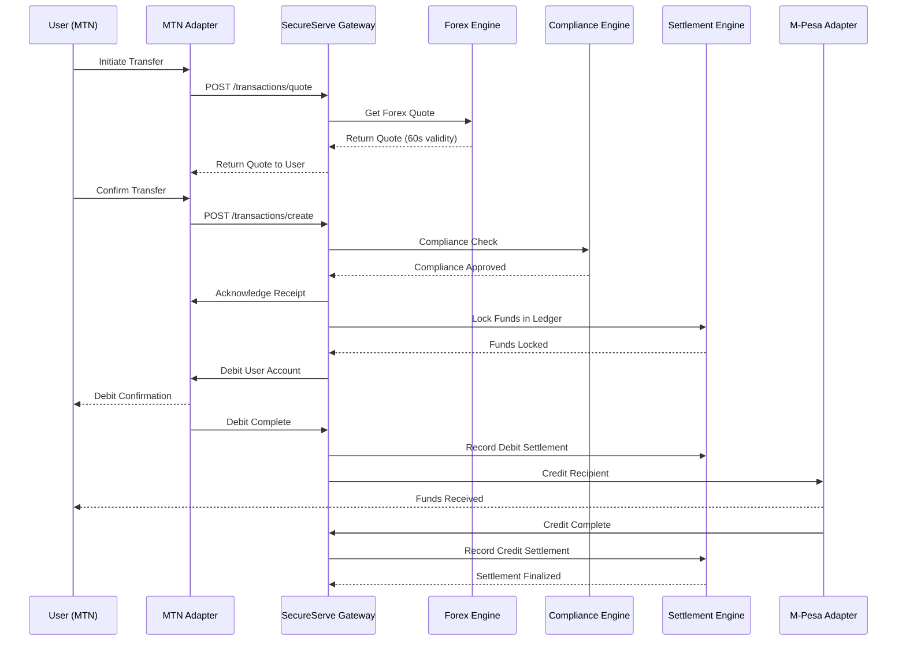

# SecureServe Technical Specification v1.0

## 1. System Overview

### 1.1 Vision
Create a decentralized settlement network that interconnects African mobile money systems through a standardized protocol and gateway API.

### 1.2 Core Architecture Principles
- **B2B2C Model**: Partner with telcos, don't compete
- **Protocol First**: Open standards, proprietary implementation
- **Regulatory Compliance by Design**: Built for multi-jurisdictional compliance
- **High Availability**: 99.9% uptime requirement
- **Real-time Processing**: Sub-30 second transaction completion

## 2. System Architecture

### 2.1 High-Level Components

```
┌─────────────────┐    ┌──────────────────┐    ┌─────────────────┐
│   Partner Telco │    │   SecureServe Cloud   │    │   Partner Telco │
│   (e.g., MTN)   │◄──►│     Platform     │◄──►│   (e.g., M-Pesa)│
└─────────────────┘    └──────────────────┘    └─────────────────┘
         │                        │                        │
         │                        │                        │
    ┌───────────┐            ┌───────────┐            ┌───────────┐
    │  Adapter  │            │   Core    │            │  Adapter  │
    │   Node    │            │ Services  │            │   Node    │
    └───────────┘            └───────────┘            └───────────┘
```

### 2.2 Core Microservices Architecture

```
┌─────────────────────────────────────────────────────────────────┐
│                        SecureServe PLATFORM                          │
├─────────────────────────────────────────────────────────────────┤
│  ┌────────────┐  ┌────────────┐  ┌────────────┐  ┌────────────┐ │
│  │   API      │  │  Forex     │  │ Compliance │  │ Settlement │ │
│  │ Gateway    │  │ Engine     │  │ Engine     │  │ Engine     │ │
│  └────────────┘  └────────────┘  └────────────┘  └────────────┘ │
├─────────────────────────────────────────────────────────────────┤
│  ┌────────────┐  ┌────────────┐  ┌────────────┐  ┌────────────┐ │
│  │  Partner   │  │ Transaction│  │  Reporting │  │   Auth &   │ │
│  │ Management │  │ Orchestrator│  │   & Analytics│ │  Security  │ │
│  └────────────┘  └────────────┘  └────────────┘  └────────────┘ │
└─────────────────────────────────────────────────────────────────┘
```

## 3. Detailed Component Specifications

### 3.1 API Gateway Service
**Purpose**: Single entry point for all external communications

**Technical Stack**:
- **Runtime**: Node.js 18+ with TypeScript
- **Framework**: NestJS
- **API**: RESTful JSON API, WebSocket for real-time updates
- **Security**: JWT tokens, Mutual TLS, OAuth 2.0

**Endpoints**:
```typescript
// Transaction Management
POST /v1/transactions/quote
POST /v1/transactions/create
GET  /v1/transactions/{id}

// Partner Management
GET  /v1/partners
POST /v1/partners/{id}/webhooks

// System Health
GET  /health
GET  /v1/system/status
```

### 3.2 Forex Engine
**Purpose**: Real-time exchange rate management and currency conversion

**Technical Stack**:
- **Runtime**: Python 3.9+
- **Framework**: FastAPI
- **Data**: Redis for caching, PostgreSQL for historical data

**Key Features**:
```python
class ForexEngine:
    async def get_quote(
        self, 
        source_currency: str, 
        target_currency: str, 
        amount: Decimal
    ) -> ForexQuote:
        # Implements:
        # 1. Real-time rate aggregation from multiple providers
        # 2. Rate caching with 10-second TTL
        # 3. Margin calculation
        # 4. Regulatory fee inclusion
        pass
    
    async def execute_conversion(
        self, 
        quote_id: str, 
        transaction_id: str
    ) -> ConversionResult:
        # Lock in rate and execute conversion
        pass
```

### 3.3 Compliance Engine
**Purpose**: Real-time AML/CFT screening and regulatory compliance

**Technical Stack**:
- **Runtime**: Java 17
- **Framework**: Spring Boot
- **ML**: TensorFlow for anomaly detection

**Screening Rules**:
```java
public interface ComplianceRule {
    ComplianceResult validate(Transaction transaction);
}

// Implemented Rules:
// - Amount-based thresholds per corridor
// - Velocity checking (transactions per hour/day)
// - Watchlist screening (integrated with local regulators)
// - Behavioral anomaly detection
// - PEP (Politically Exposed Persons) screening
```

### 3.4 Settlement Engine & SecureServe Net
**Purpose**: Immutable transaction settlement and reconciliation

**Technical Stack**:
- **Consensus**: Practical Byzantine Fault Tolerance (pBFT)
- **Ledger**: Custom built in Go
- **Database**: PostgreSQL for indexed data

**Ledger Structure**:
```go
type SettlementBlock struct {
    BlockNumber    uint64          `json:"blockNumber"`
    PreviousHash   string          `json:"previousHash"`
    Timestamp      int64           `json:"timestamp"`
    Transactions   []SettlementTx  `json:"transactions"`
    MerkleRoot     string          `json:"merkleRoot"`
    Signatures     []NodeSignature `json:"signatures"`
}

type SettlementTx struct {
    TxID           string          `json:"txId"`
    SecureServeTxID     string          `json:"SecureServeTxId"`
    FromPartner    string          `json:"fromPartner"`
    ToPartner      string          `json:"toPartner"`
    Amount         decimal.Decimal `json:"amount"`
    Currency       string          `json:"currency"`
    Status         TxStatus        `json:"status"`
    CreatedAt      int64           `json:"createdAt"`
}
```

### 3.5 Partner Adapters
**Purpose**: Abstract partner-specific API differences

**Adapter Interface**:
```typescript
interface PartnerAdapter {
  // Connection management
  authenticate(): Promise<AuthResult>;
  healthCheck(): Promise<HealthStatus>;
  
  // Transaction operations
  debitAccount(params: DebitParams): Promise<DebitResult>;
  creditAccount(params: CreditParams): Promise<CreditResult>;
  checkTransactionStatus(txId: string): Promise<TxStatus>;
  
  // Webhook handling
  registerWebhook(url: string, events: WebhookEvent[]): Promise<void>;
}

// Example M-Pesa Adapter Implementation
class MPesaAdapter implements PartnerAdapter {
  private readonly baseURL: string;
  private readonly credentials: MPesaCredentials;
  
  async debitAccount(params: DebitParams): Promise<DebitResult> {
    // M-Pesa specific B2C API implementation
    const response = await this.callMPesaAPI('/b2c/paymentrequest', {
      phoneNumber: params.phoneNumber,
      amount: params.amount,
      transactionReference: params.reference,
      callbackURL: this.webhookURL
    });
    
    return {
      success: response.ResponseCode === '0',
      transactionId: response.ConversationID,
      partnerReference: response.OriginatorConversationID
    };
  }
}
```

## 4. Data Models

### 4.1 Core Transaction Flow
```sql
-- Transactions Table
CREATE TABLE transactions (
    id UUID PRIMARY KEY DEFAULT gen_random_uuid(),
    correlation_id VARCHAR(100) UNIQUE NOT NULL,
    source_partner VARCHAR(50) NOT NULL,
    destination_partner VARCHAR(50) NOT NULL,
    source_amount DECIMAL(15,2) NOT NULL,
    destination_amount DECIMAL(15,2) NOT NULL,
    source_currency CHAR(3) NOT NULL,
    destination_currency CHAR(3) NOT NULL,
    forex_rate DECIMAL(10,6) NOT NULL,
    status VARCHAR(20) NOT NULL, -- PENDING, LOCKED, SETTLED, FAILED
    sender_phone VARCHAR(20) NOT NULL,
    recipient_phone VARCHAR(20) NOT NULL,
    created_at TIMESTAMPTZ DEFAULT NOW(),
    updated_at TIMESTAMPTZ DEFAULT NOW(),
    
    -- Compliance fields
    compliance_status VARCHAR(20) NOT NULL,
    risk_score INTEGER DEFAULT 0
);

-- Settlement Table
CREATE TABLE settlements (
    id UUID PRIMARY KEY,
    partner_id VARCHAR(50) NOT NULL,
    currency CHAR(3) NOT NULL,
    amount DECIMAL(15,2) NOT NULL,
    type VARCHAR(10) NOT NULL, -- CREDIT, DEBIT
    settlement_date DATE NOT NULL,
    status VARCHAR(20) NOT NULL,
    ledger_block_number BIGINT,
    created_at TIMESTAMPTZ DEFAULT NOW()
);
```

## 5. Transaction Flow Specification

### 5.1 Happy Path Sequence


### 5.2 Error Handling & Compensation
```typescript
interface CompensationHandler {
  handleDebitFailure(transaction: Transaction): Promise<void>;
  handleCreditFailure(transaction: Transaction): Promise<void>;
  handleTimeout(transaction: Transaction): Promise<void>;
  handleComplianceRejection(transaction: Transaction): Promise<void>;
}

// Example compensation flow
class DefaultCompensationHandler implements CompensationHandler {
  async handleCreditFailure(transaction: Transaction): Promise<void> {
    // 1. Mark transaction as FAILED
    // 2. Initiate refund to sender
    // 3. Notify both parties
    // 4. Log for manual intervention if needed
  }
}
```

## 6. Security Specification

### 6.1 Authentication & Authorization
```yaml
Security Layers:
  - Layer 1: Mutual TLS for all partner connections
  - Layer 2: JWT tokens with short expiration (5 minutes)
  - Layer 3: API key rotation every 90 days
  - Layer 4: IP whitelisting for partner endpoints
```

### 6.2 Data Protection
```typescript
// Data encryption at rest and in transit
class DataEncryption {
  static async encryptSensitiveData(data: string): Promise<string> {
    // Use AES-256-GCM for sensitive fields
    // Key management via AWS KMS/Hashicorp Vault
  }
  
  static async hashPhoneNumber(phone: string): Promise<string> {
    // Use salted SHA-256 for phone number hashing
    // Different salt per partner for data isolation
  }
}
```

## 7. Deployment & Infrastructure

### 7.1 Cloud Architecture
```yaml
Infrastructure:
  Primary Region: eu-west-1 (Dublin)
  Secondary Region: af-south-1 (Cape Town)
  
Services:
  - ECS Fargate for stateless services
  - Amazon RDS PostgreSQL for persistent data
  - ElastiCache Redis for caching and session storage
  - Amazon MQ for message queueing
  
Monitoring:
  - CloudWatch for metrics and logging
  - X-Ray for distributed tracing
  - PagerDuty for alerting
```

### 7.2 Scaling Strategy
```typescript
// Auto-scaling configuration
const scalingConfig = {
  apiGateway: {
    minCapacity: 2,
    maxCapacity: 50,
    targetCPU: 70,
    targetMemory: 80
  },
  forexEngine: {
    minCapacity: 2, 
    maxCapacity: 20,
    queueBasedScaling: true
  }
};
```

## 8. Testing Strategy

### 8.1 Test Pyramid
```typescript
// Unit Tests (70%)
describe('ForexEngine', () => {
  it('should calculate correct exchange rate with margin', () => {
    // Test business logic in isolation
  });
});

// Integration Tests (20%)  
describe('Transaction Flow', () => {
  it('should complete successful end-to-end transfer', async () => {
    // Test with partner sandboxes
  });
});

// E2E Tests (10%)
describe('Production Corridor', () => {
  it('should process live transactions in staging', () => {
    // Test with real partner APIs in staging
  });
});
```

## 9. Compliance & Regulatory Requirements

### 9.1 Per-Country Implementation
```typescript
interface RegulatoryConfig {
  country: string;
  maxTransactionLimit: number;
  dailyLimit: number;
  requiredFields: string[];
  reportingRequirements: ReportingRule[];
  kycRequirements: KYCTier[];
}

// Example: Ghana configuration
const ghanaConfig: RegulatoryConfig = {
  country: 'GH',
  maxTransactionLimit: 5000, // USD equivalent
  dailyLimit: 10000,
  requiredFields: ['senderIdType', 'senderIdNumber', 'purpose'],
  reportingRequirements: [/* Bank of Ghana rules */],
  kycRequirements: [/* Tiered KYC rules */]
};
```

## 10. Implementation Roadmap

### Phase 1 (Months 1-3): Core Platform
- [ ] Basic API Gateway
- [ ] Forex Engine MVP
- [ ] PostgreSQL database design
- [ ] Partner adapter interface
- [ ] Basic compliance rules

### Phase 2 (Months 4-6): First Corridor
- [ ] MTN Ghana adapter
- [ ] M-Pesa Kenya adapter  
- [ ] SecureServe Net settlement layer
- [ ] Enhanced compliance engine
- [ ] Partner onboarding process

### Phase 3 (Months 7-12): Scale & Optimize
- [ ] Additional corridor expansion
- [ ] Advanced fraud detection
- [ ] Performance optimization
- [ ] Developer portal
- [ ] Analytics and reporting

This technical specification provides the foundation for building SecureServe. Each component can be developed independently by dedicated teams while maintaining clear integration contracts.